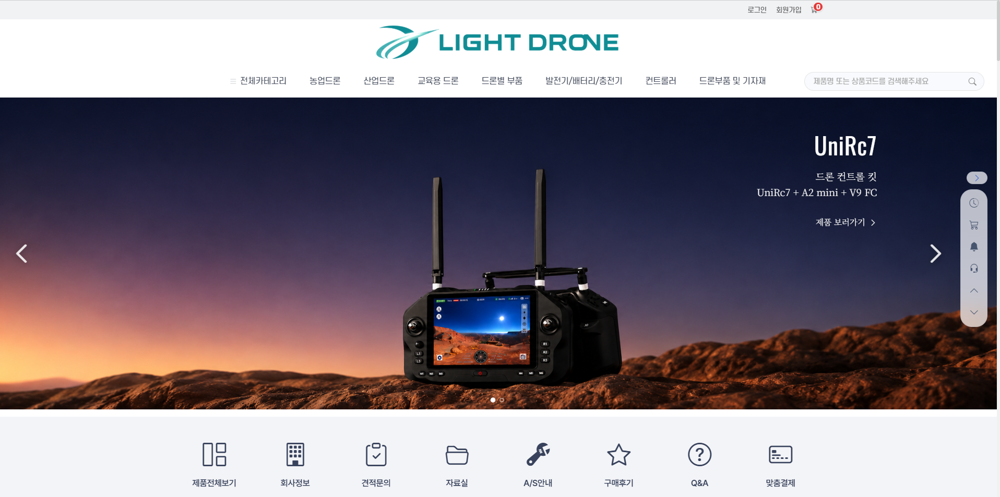
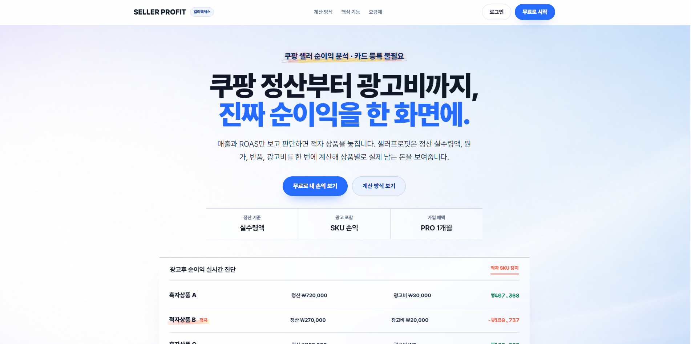

<h1 align="center">조민석 · Backend Developer</h1>

  쓰는 사람 입장을 먼저 고민하는 개발자가 되겠습니다.

  
  

 

## About

Java와 Spring Boot 기반 웹 서비스를 기획부터 개발·배포까지 직접 경험한 백엔드 개발자입니다.
기존 홈페이지 운영자의 요청으로 실제 운영 중인 농업용 드론 쇼핑몰 라이트드론을 PHP에서 Spring Boot로 단독 재구축하며, 결제·인증·DB 마이그레이션처럼 운영에 필요한 기능을 직접 다뤄봤습니다.
비전공에서 시작해 매일 학습하며 기본기를 다지고 있으며, 문제가 생기면 원인과 조치를 기록해 같은 문제를 반복하지 않도록 합니다.

 

## Tech Stack

**Language**

   

**Backend**

    

**Database**

   

**Frontend & Tools**

    

 

## Projects

### 라이트드론 — 드론 판매 쇼핑몰

> 실제 운영 중인 농업용 드론 판매 쇼핑몰 · 기획부터 개발·배포까지 단독 수행

**Tech** · Java 21 · Spring Boot · Spring Security · JPA · PostgreSQL · Flyway · Toss Payments · OAuth2

- 기존 PHP 사이트를 중단 없이 Spring Boot로 재구축 — 인증·결제·상품·주문·관리자 콘솔 전면 이전
- 운영자가 코드 수정 없이 홈 화면을 관리하는 홈 패널 관리 기능 설계·구현
- Toss Payments 결제 연동 — 멱등 처리로 중복 결제·중복 SMS 차단, Webhook은 원장 재조회로 검증
- Flyway 기반 스키마 변경 이력 관리, 시크릿 환경변수 외부화로 보안 강화

**Links** · [운영 사이트](https://lightdrone.co.kr) · [GitHub](https://github.com/socome6586-coder/lightdrone) · [Notion](https://app.notion.com/p/lightdrone-395768cb39df80e08ab3e7706bec65a6)

---

### 셀러프로핏 — 쿠팡 순이익 분석 서비스 *(진행 중)*

> 개인 프로젝트 · 쿠팡 정산·주문 데이터 기반 상품별 순이익 분석

**Tech** · Java 21 · Spring Boot · Spring Data JPA · PostgreSQL · React · Vite · Docker · Caddy

- Spring Boot REST API + React 반응형 UI 개발
- Coupang Open API 연동, Docker/Caddy 기반 배포 환경 구성

**Links** · [사이트](https://sellerprofit.co.kr) · [GitHub](https://github.com/socome6586-coder/seller-profit) · [Notion](https://app.notion.com/p/seller-profit-39c768cb39df800fbfc9e9ff5caa6bba)

---

### SBN (Social Baseball Net) — 사회인 야구단 커뮤니티

> 4인 팀 프로젝트 · Team 파트 담당, 전체 UI/UX 주도

**Tech** · Java · Spring Boot · MyBatis · Oracle · JSP

- Team 파트 전체 CRUD(목록·상세·생성·가입신청·승인/거절/제거) 및 팀 로고 업로드 구현
- 전체 27개 JSP 페이지 UI/UX 디자인 주도, 9개 테이블 ERD 설계 참여
- `main → develop → feature` Git 브랜치 전략 + PR 코드 리뷰 기반 협업

**Links** · [GitHub](https://github.com/ssm512/SBNPrj) · [Notion](https://app.notion.com/p/Social-Baseball-Net-SBN-39c768cb39df8024b92edd66dabc556a)

---

### EduBridge — AI 기능이 반영된 학원 출결 앱 *(진행 중)*

> 팀 프로젝트 · 출결·성적/상담 관리 및 AI 리포트 기능 담당

**Tech** · Java · Spring Boot · Spring Security · MyBatis · PostgreSQL · Chart.js · Gemini API

- 성적 입력/조회 자동화, 성적 추이 시각화(Chart.js)
- Gemini API 연동 AI 리포트, 권한별 화면 분리

**Links** · [GitHub](https://github.com/ssm512/EduBridgePrj)

 

---

## Education

- **『디지털컨버전스』 데이터 융합 자바(JAVA) & 스프링(Spring) A** · 그린컴퓨터아카데미 · 2026.02 – 2026.08
  - Java·Spring 기반 웹 애플리케이션 개발 및 서버 프로그래밍
  - JSP·Servlet 활용 CRUD 구현 및 REST API 연동
  - ORACLE 데이터베이스 설계·구현 및 SQL 활용 데이터 처리
  - HTML/CSS/JavaScript 기반 화면 구현 및 인터페이스 설계
  - SW 개발 보안 구축, 애플리케이션 테스트 및 프로젝트 수행
- **컴퓨터공학 학사 취득 중** · 학점은행제 + 자격증 시험 병행

## Activity

  

  

