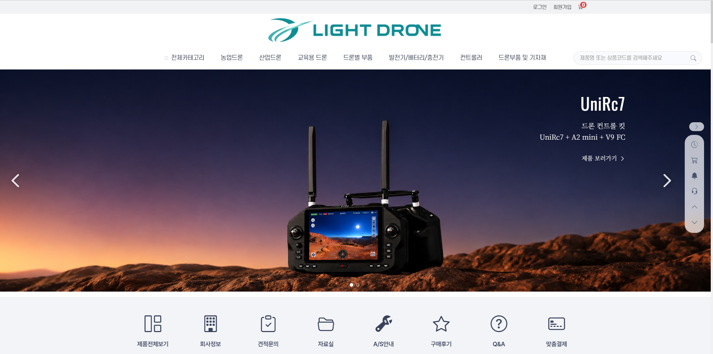
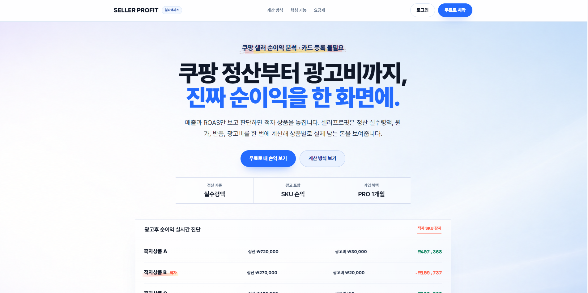

<!-- ═══════════════ 헤더 ═══════════════ -->


<p align="center">
  
</p>

<p align="center">
  <a href="https://lightdrone.co.kr"></a>
  <a href="https://mail.google.com/mail/?view=cm&fs=1&to=socome6586@gmail.com"></a>
  <a href="https://app.notion.com/p/62f768cb39df82c79012813557856c63"></a>
  
</p>

<br/>

<!-- ═══════════════ 소개 ═══════════════ -->
<h2 align="center">소개</h2>

<p align="center">
<b>기획부터 개발·배포까지</b> 직접 해보며 배우고 있는 신입 백엔드 개발자입니다.
</p>

```yaml
이름:   조민석
직무:   백엔드 개발자 (신입)
주력:   [Java, Spring Boot, PostgreSQL]

만든_것:
  - lightdrone.co.kr    # 농업용 드론 쇼핑몰 · 운영 중 · 단독 개발
  - sellerprofit.co.kr  # 쿠팡 순이익 분석 · 개발 중

해본_것:
  - PHP 쇼핑몰을 Spring Boot로 재구축 (인증 · 결제 · 상품 · 주문 · 관리자)
  - 결제 연동과 DB 마이그레이션을 실제 운영 환경에서 처리

배우는_중:
  - 테스트 코드 작성, 쿼리 성능 개선, 클라우드 배포

일하는_방식: >
  비전공으로 시작해 매일 조금씩 쌓아가고 있습니다.
  막힌 부분은 원인과 조치를 기록으로 남겨
  같은 문제를 두 번 겪지 않으려 합니다.
```

<br/>

<!-- ═══════════════ 기술 스택 ═══════════════ -->
<h2 align="center">기술 스택</h2>

<p align="center"><b>언어 &amp; 백엔드</b></p>
<table align="center">
  <tr>
    <td align="center" width="90"><br/>Java</td>
    <td align="center" width="90"><br/>Spring</td>
    <td align="center" width="90"><br/>Hibernate</td>
    <td align="center" width="90"><br/>Gradle</td>
    <td align="center" width="90"><br/>Maven</td>
  </tr>
</table>

<p align="center"><b>데이터베이스 &amp; 인프라</b></p>
<table align="center">
  <tr>
    <td align="center" width="90"><br/>PostgreSQL</td>
    <td align="center" width="90"><br/>MySQL</td>
    <td align="center" width="90"><br/>Docker</td>
    <td align="center" width="90"><br/>Linux</td>
    <td align="center" width="90"><br/>Nginx</td>
  </tr>
</table>

<p align="center"><b>프론트엔드</b></p>
<table align="center">
  <tr>
    <td align="center" width="90"><br/>JavaScript</td>
    <td align="center" width="90"><br/>HTML5</td>
    <td align="center" width="90"><br/>CSS3</td>
    <td align="center" width="90"><br/>React</td>
    <td align="center" width="90"><br/>Vite</td>
    <td align="center" width="90"><br/>Bootstrap</td>
    <td align="center" width="90"><br/>jQuery</td>
  </tr>
</table>

<p align="center"><b>도구</b></p>
<table align="center">
  <tr>
    <td align="center" width="90"><br/>IntelliJ IDEA</td>
    <td align="center" width="90"><br/>Eclipse</td>
    <td align="center" width="90"><br/>VS Code</td>
    <td align="center" width="90"><br/>Git</td>
    <td align="center" width="90"><br/>GitHub</td>
    <td align="center" width="90"><br/>Postman</td>
  </tr>
</table>

<p align="center">
  
  
  
  
  
  
  
  
  
</p>
<br/>

<!-- ═══════════════ 프로젝트 ═══════════════ -->
<h2 align="center">프로젝트</h2>

<p align="center"><b>개인 프로젝트</b></p>

<table align="center">
<tr>
<td width="50%" valign="top">

<a href="https://lightdrone.co.kr"></a>

### 라이트드론


> 실제 운영 중인 농업용 드론 판매 쇼핑몰


- 기존 PHP 사이트를 **중단 없이** Spring Boot로 전면 이전
- 운영자가 코드 수정 없이 홈 화면을 바꾸는 **홈 패널 관리** 구현
- Toss Payments 연동 시 **멱등 처리**로 중복 결제·SMS 차단, Webhook은 원장 재조회로 검증
- Flyway로 스키마 이력 관리, 시크릿 환경변수 외부화

<a href="https://lightdrone.co.kr"></a>
<a href="https://github.com/socome6586-coder/lightdrone"></a>
<a href="https://app.notion.com/p/lightdrone-395768cb39df80e08ab3e7706bec65a6"></a>

</td>
<td width="50%" valign="top">

<a href="https://sellerprofit.co.kr"></a>

### 셀러프로핏


> 쿠팡 정산·주문 데이터로 상품별 순이익을 분석


- Spring Boot REST API + React 반응형 화면 개발
- Coupang Open API 연동으로 정산·주문 데이터 자동 수집
- 상품 단위 마진 계산 로직 설계
- Docker / Caddy 기반 배포 환경 구성

<a href="https://sellerprofit.co.kr"></a>
<a href="https://github.com/socome6586-coder/seller-profit"></a>
<a href="https://app.notion.com/p/seller-profit-39c768cb39df800fbfc9e9ff5caa6bba"></a>

</td>
</tr>
</table>

<br/>

<p align="center"><b>팀 프로젝트</b></p>

<table align="center">
<tr>
<td width="50%" valign="top">

<a href="https://github.com/ssm512/SBNPrj"></a>

### SBN (Social Baseball Net)


> 사회인 야구단 커뮤니티 — Team 파트 담당


- Team 파트 **전체 CRUD**(목록·상세·생성·가입신청·승인/거절/제거) 및 팀 로고 업로드 구현
- 전체 **27개 JSP 페이지** UI/UX 디자인 주도, **9개 테이블** ERD 설계 참여
- `main → develop → feature` 브랜치 전략과 PR 코드 리뷰 기반 협업

<a href="https://github.com/ssm512/SBNPrj"></a>
<a href="https://app.notion.com/p/Social-Baseball-Net-SBN-39c768cb39df8024b92edd66dabc556a"></a>

</td>
<td width="50%" valign="top">

<a href="https://github.com/ssm512/EduBridgePrj"></a>

### EduBridge


> AI 리포트가 붙은 학원 출결·성적 관리 앱


- 성적 입력/조회 자동화, 성적 추이 시각화(Chart.js)
- **Gemini API** 연동 AI 학습 리포트 생성
- Spring Security 기반 권한별 화면 분리

<a href="https://github.com/ssm512/EduBridgePrj"></a>

</td>
</tr>
</table>

<br/>

<!-- ═══════════════ 활동 기록 ═══════════════ -->
<h2 align="center">활동 기록</h2>

<div align="center">


</div>

<p align="center">
  
</p>

<br/>

<!-- ═══════════════ 교육 ═══════════════ -->
<h2 align="center">교육</h2>

<table align="center">
<tr>
<td valign="top" width="32%">

**그린컴퓨터아카데미**

`2026.02 – 2026.08`

『디지털컨버전스』
데이터 융합 자바 &amp; 스프링 A

</td>
<td valign="top" width="68%">

- Java·Spring 기반 웹 애플리케이션 개발 및 서버 프로그래밍
- JSP·Servlet 활용 CRUD 구현 및 REST API 연동
- Oracle 데이터베이스 설계·구현 및 SQL 활용 데이터 처리
- HTML/CSS/JavaScript 기반 화면 구현 및 인터페이스 설계
- SW 개발 보안 구축, 애플리케이션 테스트 및 프로젝트 수행

</td>
</tr>
<tr>
<td valign="top">

**컴퓨터공학 학사**

`취득 중`

</td>
<td valign="top">

- 학점은행제 + 자격증 시험 병행

</td>
</tr>
</table>

<br/>


